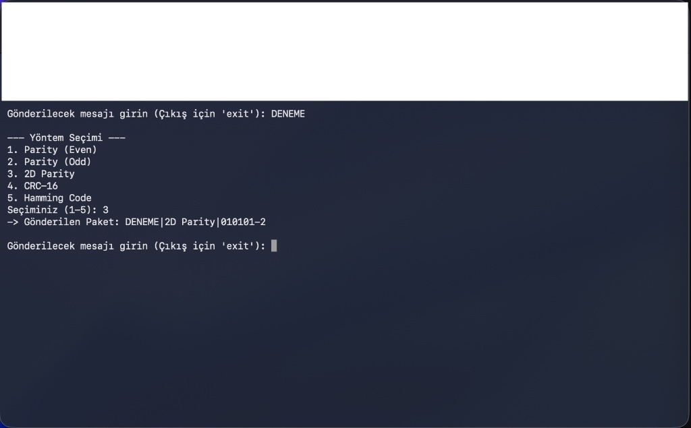
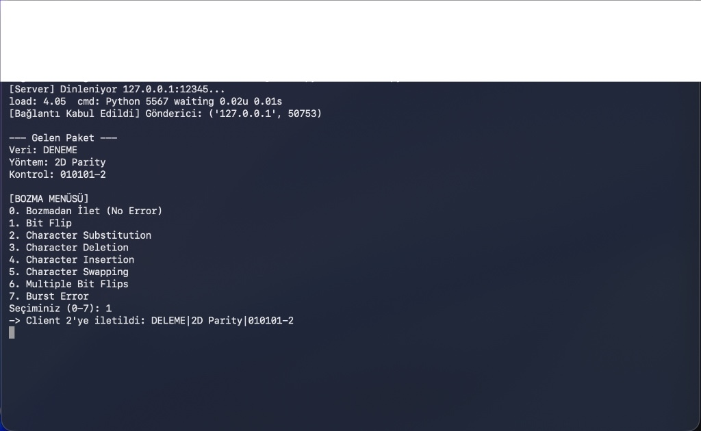

# Data Communication & Socket Programming Project

##  Project Description
This project demonstrates the fundamental concepts of **Data Communication** and **Error Detection Methods** using Python Socket Programming.

The system simulates a real-world data transmission scenario consisting of three components:
1.  **Client 1 (Sender):** Encodes the user's message using a selected error detection algorithm (Parity, 2D Parity, CRC, Hamming).
2.  **Server (Channel/Noise):** Acts as an intermediate node that can inject various types of errors (Bit flip, burst error, etc.) into the transmitted data.
3.  **Client 2 (Receiver):** Receives the packet, performs the same error detection calculation, and verifies the integrity of the data.

##  Features
- **TCP/IP Socket Communication:** Reliable data transfer between three distinct nodes.
- **Error Detection Algorithms Implemented:**
    - Single Parity Check (Even/Odd)
    - **2D Parity (Matrix Parity)** (Row and Column check)
    - CRC-16 (Cyclic Redundancy Check)
    - Hamming Code
- **Error Injection (Noise Simulation):**
    - Bit Flipping
    - Character Substitution / Deletion / Insertion
    - Burst Errors

##  Project Structure
- `client1.py`: Sender application. Handles user input and generates check bits.
- `server.py`: Intermediate server. Forwards data and simulates channel noise (errors).
- `client2.py`: Receiver application. Validates the received data integrity.

##  Installation & Requirements
- **Language:** Python 3.x
- **Libraries:** Standard libraries only (`socket`, `binascii`, `random`, `string`). No external installation required.

##  How to Run
You need to open **3 separate terminal windows** to run the project.

**Step 1: Start the Receiver (Client 2)**
This node listens for incoming data from the server.
```bash
python3 client2.py
```

**Step 2: Start the Server**
The server acts as a bridge between the sender and receiver.
```bash
python3 server.py
```

**Step 3: Start the Sender (Client 1)**
Connects to the server and allows you to input messages.
```bash
python3 client1.py
```

##  Screenshots

### 1. Sender (Client 1) - Sending Data


### 2. Server - Injecting Errors


### 3. Receiver (Client 2) - Detecting Corruption


##  Usage Example
1.  **Sender:** User enters `HELLO` and selects **CRC-16**.
2.  **Server:** Intercepts the packet. The user chooses **"Bit Flip"** to corrupt the data.
3.  **Receiver:** Calculates the CRC of the received data, compares it with the sent checksum, and displays: `Status: DATA CORRUPTED`.

##  License
This project is created for the Data Communication course assignment. 

TALHA ÇAĞRI TERZİOĞLU - 2010205022
BEDİRHAN ENES ÖZCAN   - 2010205063
